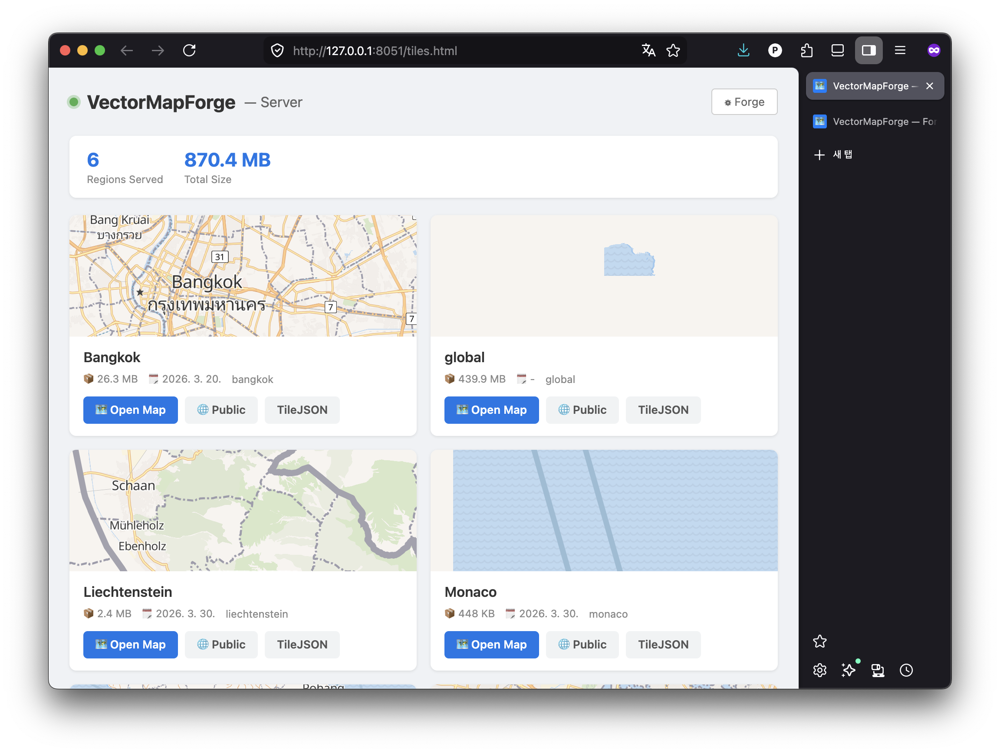
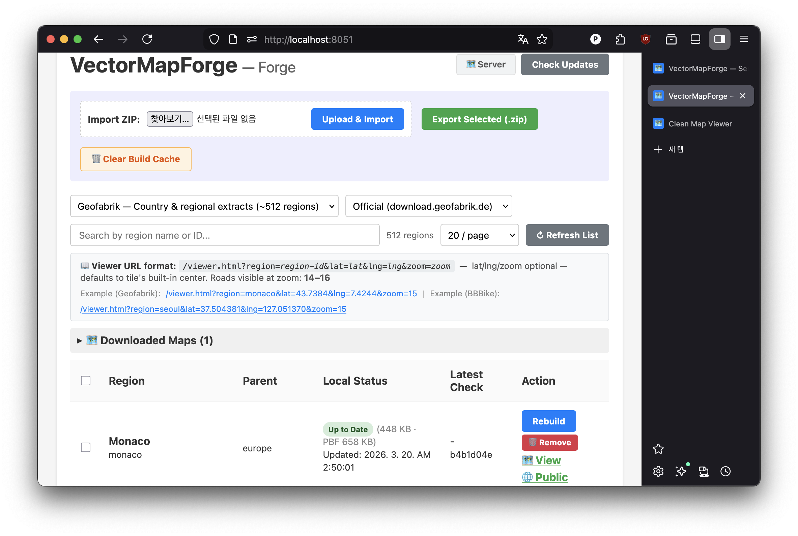
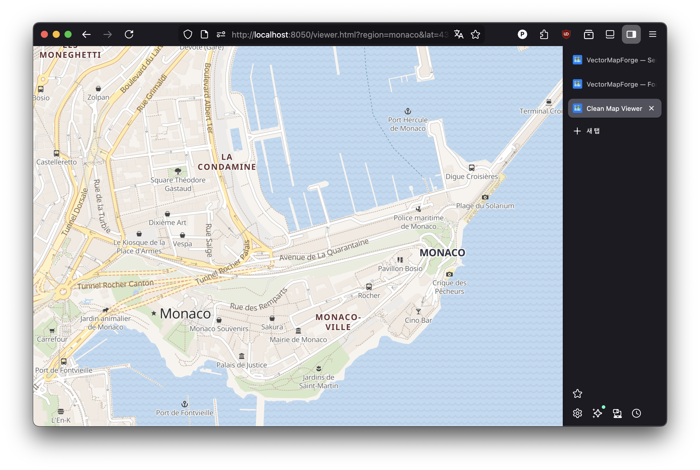

# VectorMapForge

Self-hosted OpenStreetMap vector tile server.
Build regional tile data on desktop, serve it anywhere.

```
Desktop  →  Download PBF  →  Build tiles (Planetiler)  →  Export ZIP
Server   →  Import ZIP    →  Serve vector tiles + map viewer
```

---

## Screenshots

| Server Dashboard | Forge (Build Manager) | Map Viewer |
|:---:|:---:|:---:|
|  |  |  |

---

## Features

- **Dual-port architecture** — public tile serving on 8050, admin dashboard on 8051 (localhost only)
- **Multi-source** — Geofabrik (512 regional extracts) and BBBike (238 city extracts)
- **Mirror selection** — per-source mirror dropdown + custom mirror URL
- **Build manager** — download PBF, run Planetiler, monitor progress via live log stream
- **Export / Import** — ZIP bundles for moving built tiles from desktop to server
- **Update checker** — MD5-based remote change detection
- **MapLibre-ready** — auto-generated style JSON with sprite, font, and tile URL rewriting
- **Reverse proxy friendly** — `PUBLIC_URL` env var for correct TileJSON and style URLs

---

## Port Architecture

| Port | Access | Purpose |
|------|--------|---------|
| `8050` | Public | Tiles, map viewer, TileJSON, styles |
| `8051` | **Localhost only** | Forge build manager, import/export, remove tiles |

> **Security warning:** Never expose port `8051` externally. Anyone with access to it can delete or overwrite your tile data. Always expose only port `8050` via reverse proxy. Access `8051` via SSH tunnel when needed.

---

## Quick Start

### Desktop (build + serve)

```bash
docker compose -f docker-compose.desktop.yml up -d
```

Open Forge at **http://localhost:8051**, search for a region, and click **Download / Build**.

### Server (serve only)

```bash
docker compose -f docker-compose.server.yml up -d
```

Build is disabled on the server. Import tile ZIPs exported from the desktop.

---

## Access URLs

| Purpose | URL |
|---------|-----|
| **Server dashboard** | `http://HOST:8050/tiles.html` |
| **Forge (build manager)** | `http://localhost:8051/` — localhost only |
| **Map viewer** | `http://HOST:8050/viewer.html?region=REGION_ID` |
| **TileJSON** | `http://HOST:8050/data/REGION_ID.json` |
| **Vector tile** | `http://HOST:8050/data/REGION_ID/{z}/{x}/{y}.pbf` |
| **MapLibre style** | `http://HOST:8050/styles/REGION_ID/style.json` |

### Viewer URL parameters

```
/viewer.html?region=REGION_ID&lat=LAT&lng=LNG&zoom=ZOOM
```

`lat`, `lng`, `zoom` are optional — defaults to the tile's built-in center. Roads are visible at zoom **14–16**.

```
/viewer.html?region=monaco&lat=43.7384&lng=7.4244&zoom=15
/viewer.html?region=seoul&lat=37.504381&lng=127.051370&zoom=15
```

---

## Desktop → Server Workflow

> **Note:** The server compose (`docker-compose.server.yml`) runs with `BUILD_DISABLED=true` — the build API is blocked (403). All tile building must be done on a desktop machine and transferred as a ZIP.

### 1. Build on desktop

```bash
docker compose -f docker-compose.desktop.yml up -d
```

1. Open **http://localhost:8051**
2. Search for a region (e.g. `south-korea`)
3. Click **Download / Build** and wait for completion

### 2. Export as ZIP

1. Check the region checkbox in Forge
2. Click **Export Selected (.zip)**
3. Save `vectormapforge-export-YYYY-MM-DD.zip`

ZIP contents:
```
vectormapforge-export-2026-03-20.zip
├── south-korea.mbtiles   # vector tile database
└── db.json               # metadata (MD5, update timestamps)
```

### 3. Transfer to server

```bash
scp vectormapforge-export-*.zip user@server:/home/user/
```

### 4. Import on server

**Option A — Dashboard (recommended)**

```bash
ssh -L 8051:localhost:8051 user@server
# Then open http://localhost:8051 in your local browser
```

Use **Import ZIP** → select file → **Upload & Import**.

**Option B — curl**

```bash
curl -X POST http://localhost:8051/api/import \
  -F "file=@vectormapforge-export-2026-03-20.zip"
```

### 5. Verify

```bash
curl http://localhost:8050/data/south-korea.json
```

---

## Docker Compose Files

| File | Use case |
|------|----------|
| `docker-compose.desktop.yml` | Local desktop — build + serve |
| `docker-compose.server.yml` | Remote server — serve only |

| Setting | desktop | server |
|---------|---------|--------|
| `BUILD_DISABLED` | unset (builds enabled) | `true` |
| `docker.sock` mount | ✅ required for Planetiler | ❌ |
| `osm_temp` volume | ✅ build scratch space | ❌ |
| `PLANETILER_JVM_MEMORY` | `6g` | `512m` |

---

## Commands

```bash
# Start
docker compose -f docker-compose.desktop.yml up -d

# Stop — keep data volumes (recommended)
docker compose -f docker-compose.desktop.yml down

# Restart (pick up code changes)
docker compose -f docker-compose.desktop.yml restart

# Logs
docker logs -f vectormapforge
```

> **Do not use `down -v`** — this deletes all Docker volumes including your built tile data and build cache files (lake centerlines, water polygons, Natural Earth). These auxiliary files are shared across all builds and are slow to re-download. Only use `down -v` if you intend to start completely from scratch.

---

## Build Cache

Planetiler downloads auxiliary data files on first build and reuses them on subsequent builds:

| File | Purpose |
|------|---------|
| `lake_centerline.shp.zip` | Lake centerline geometry |
| `water-polygons-split-3857.zip` | Ocean and water polygons |
| `natural_earth_vector.sqlite.zip` | Natural Earth base data |

These files rarely change. If you need to force a refresh (e.g. after a major Planetiler upgrade), use the **Clear Build Cache** button in Forge — it deletes the cached files so they are re-downloaded on the next build.

---

## Environment Variables

| Variable | Default | Description |
|----------|---------|-------------|
| `DATA_DIR` | `/osm_data` | Tiles, styles, fonts, build cache |
| `TEMP_DIR` | `/osm_temp` | Planetiler build scratch space |
| `BUILD_DISABLED` | `false` | Set `true` to disable build API (403) |
| `PUBLIC_URL` | *(none)* | External base URL for reverse proxy |
| `PLANETILER_JVM_MEMORY` | `6g` (desktop) / `512m` (server) | JVM heap for Planetiler |
| `PUBLIC_PORT` | `3000` | Internal public port |
| `ADMIN_PORT` | `3001` | Internal admin port |

---

## Reverse Proxy (nginx)

```nginx
server {
    listen 443 ssl;
    server_name tiles.example.com;

    location / {
        proxy_pass http://localhost:8050;
        proxy_set_header Host $host;
    }
}
```

Set `PUBLIC_URL` so TileJSON and style URLs resolve correctly:

```yaml
# docker-compose.server.yml
environment:
  - PUBLIC_URL=https://tiles.example.com
```

Do **not** proxy port `8051` — it is admin-only and should remain localhost only.

---

## MapLibre Integration

```javascript
const map = new maplibregl.Map({
  container: 'map',
  style: 'https://tiles.example.com/styles/south-korea/style.json',
});
```

Or with Leaflet + leaflet-maplibre-gl:

```javascript
L.maplibreGL({
  style: 'https://tiles.example.com/styles/south-korea/style.json',
}).addTo(map);
```

---

## Support This Project

If you found this project helpful, consider supporting its maintenance and future development with a small donation.
You can buy me a coffee via the Ko-fi link below — thank you! ☕✨

[](https://ko-fi.com/B0B21CR05U)

---

## License

MIT © [ppugend](https://github.com/ppugend)

---

## Data Attribution

Map tiles built with this tool contain data from **OpenStreetMap**, licensed under the [Open Database License (ODbL)](https://opendatacommons.org/licenses/odbl/).

When displaying maps publicly, you must show attribution:

```
© OpenStreetMap contributors
```

The built-in map viewer already includes this attribution. If you embed tiles in your own application, add the notice to your map UI.
